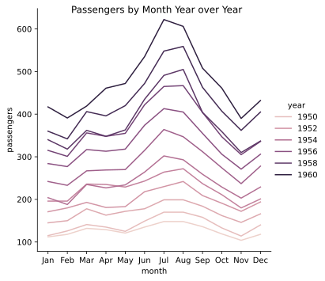
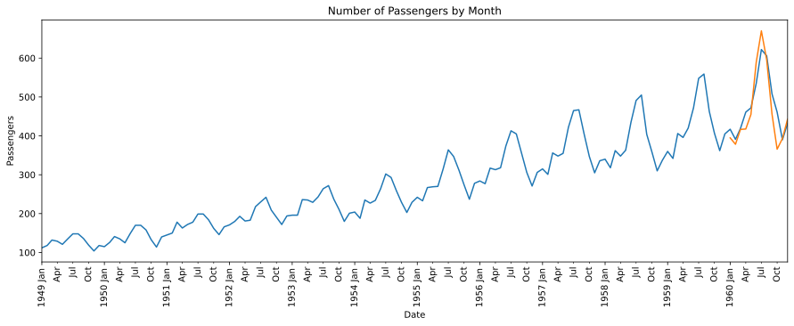

# Predicting Flight Data
Welcome to a working introduction to forecasting time-series data with the LSTM architecture.

## Summary & Objective
In this project, I explore the Flights dataset from seaborn.
I use `PyTorch`, `sklearn`, `pandas`, `seaborn`, `NumPy`, and `Matplotlib` to explore and explain trends in data while practicing building with the LSTM architecture. 

## Initial Observation
From graphing the monthly number of passengers, we see a distinct annual peak in July and August.
After the Summer concludes, the number of passengers declines and hits its low point towards late October early November.
Over the decade of data, we see the baseline passenger count increases year over year.

The consistency of these trends throughout the decade suggests a typical seasonality and experience dictates that a view of 12 months will constitute an appropriate window size with which to train the model.

## Notebook Steps
After separating training and testing data and scaling the training data, inout-sequences are constructed from the training data with the selected window size.
The model architecture is defined and then trained on the inout-sequences.

Predictions for the number of passengers for the 12 months of testing data are plotted in orange &#x1F538; alongside the actual passenger count in blue &#x1F539;.

## Conclusions
From the graph of predicted values, we demonstrate that the model captures the seasonal trend initially observed in the year-over-year plot.

This project is a small introduction to working with time-series data and building LSTM models in `PyTorch`.
I learned how to define an LSTM network and make forecasting predictions.
In addition, though not demonstrated through work here, I learned about loss functions and the `autograd` framework. 

## Ways To Improve
I observed that adding more hidden states and tuning hyperparameters can further decrease the model's loss.
A more formalized hyperparameter search may improve model performance.
I will have a more robust approach for future projects- I could implement a grid search, but a superior option would be to use an optimizer from a popular package, `sklearn`, or `ray-tune`.
Consider the hyperparameter optimization frameworks [here](https://towardsdatascience.com/10-hyperparameter-optimization-frameworks-8bc87bc8b7e3).

Additionally, gathering more features about flights, airlines, or customers may give the model more information to learn trends.
